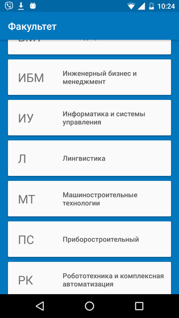
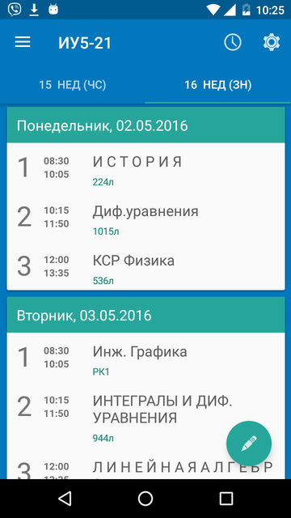
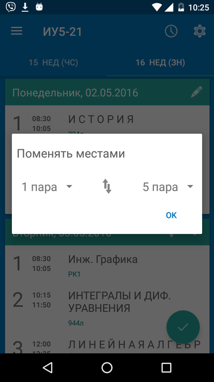
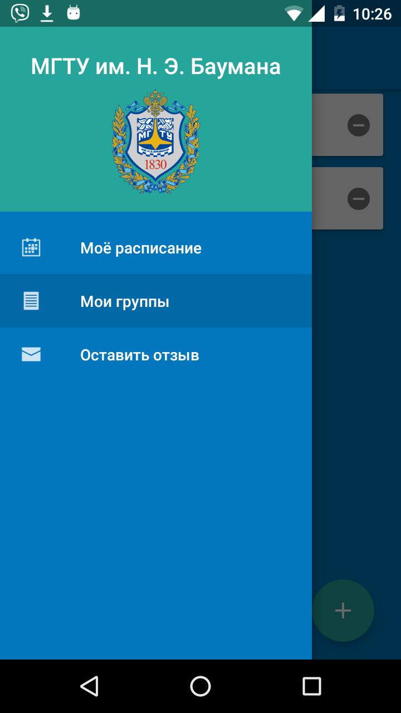

# BmstuSchedule

Pending update to Bmstu Schedule app.

Once the production server is ready, this update will be published.

Current version can be found here: https://play.google.com/store/apps/details?id=org.bmstu.BmstuSchedule  
It supports tracking schedule of all the groups in BMSTU, so that if schedule changes, updates are availible immediately. Also it supports working with schedule in offline mode.  
Update introduces base implementation of Material Design to the app. Also it adds support of editing the schedule received from back end.  
Apk file can be found in "apk" folder <a href="https://github.com/nbarishok/BmstuSchedule/tree/master/apk">here</a>  
And here are some screenshots: 

